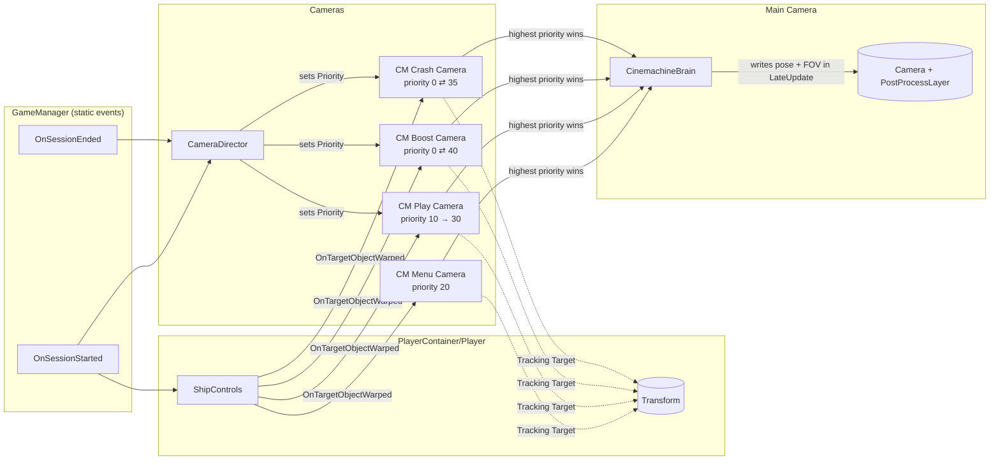
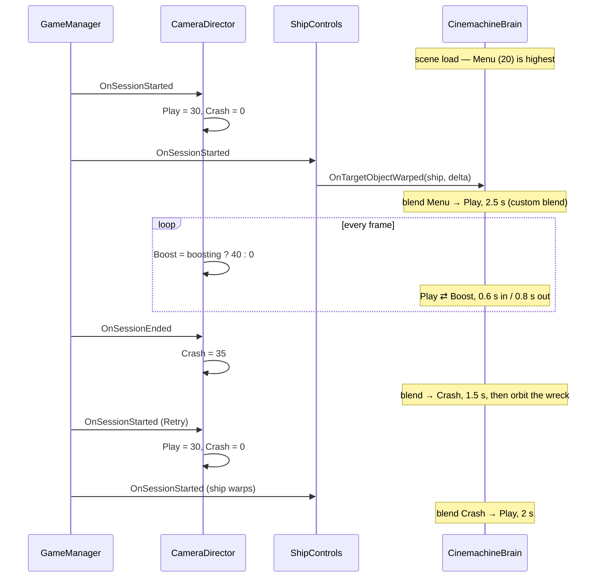

# The Simple Skyroads camera rig

How the Cinemachine camera in `MainScene` is put together, who talks to whom, and where to
turn the knobs. The design rationale is in `cinemachine-camera-plan.md`; this is the
"how it works" companion.

Cinemachine **3.1.7** (`com.unity.cinemachine`), namespace `Unity.Cinemachine`. The component
names below are the v3 ones — most tutorials online still use v2 names (`CinemachineVirtualCamera`,
Transposer, Composer), which no longer exist.

---

## The one-paragraph version

`Main Camera` no longer has any script that moves it. A `CinemachineBrain` on it copies the pose of
whichever **shot** currently has the highest *Priority*, and when that changes it **blends** from the
old shot to the new one over a couple of seconds. The four shots are `CinemachineCamera` objects under
the `Cameras` root; each one describes *where the camera should be* (Position Control) and *what it
should look at* (Rotation Control) relative to the `Player` transform. `CameraDirector` is the only
gameplay code involved: it listens to `GameManager`'s session events and raises or lowers priorities.
It never touches a transform.

---

## Who owns what



Arrows go from the thing that acts to the thing acted upon. Note the direction between the shots and
the Brain: the shots do not push anything; the Brain polls them every `LateUpdate` and decides.

---

## The GameObjects

### `Main Camera`

| Component | Role |
| --- | --- |
| `Camera`, `AudioListener`, `PostProcessLayer` | Unchanged from before. PPv2 keeps working because the camera object is the same; only the thing driving its transform changed. |
| `CinemachineBrain` | The single writer of this transform. **Update Method: LateUpdate** (same phase the old `CameraFollow` used). **Default Blend: Ease In Out, 2 s.** **Custom Blends:** `Assets/Settings/CameraBlends.asset`. |

If you ever see the camera jitter, look for a second component writing the transform. Two writers in
`LateUpdate` fight each other frame by frame. That is why `CameraFollow.cs` was deleted rather than
disabled.

### `Cameras` (empty root)

Holds `CameraDirector` and the four shots as children. The parent is at the origin and never moves;
it is purely a hierarchy folder. Every shot has **Tracking Target = `Player`** and **Lens FOV 60**
unless stated.

| Shot | When it is live | Position Control | Rotation Control | Extras |
| --- | --- | --- | --- | --- |
| `CM Menu Camera` | From scene load until the first start. Never again (the title menu is one-shot). | `CinemachineOrbitalFollow`, Sphere, radius 7.5, vertical 62° (looking down on the ship), horizontal driven by `AutoOrbit` at 10°/s | `CinemachineRotationComposer`, damping 0.2 | `CinemachineBasicMultiChannelPerlin` with the package's `Handheld_normal_mild` profile, amplitude 1, frequency 0.8 |
| `CM Play Camera` | Every session, from `OnSessionStarted`. | `CinemachineFollow`, **Binding Mode: World Space**, offset (0, 2, −6), position damping (1.6, 0.6, 0.3) | `CinemachineRotationComposer`, damping 0.6 | `Handheld_normal_mild`, amplitude 0.3, frequency 0.5 — a faint idle wobble |
| `CM Boost Camera` | While `GameInSession && IsPlayerBoosting`. | Same as play but offset (0, 2.3, −7.2); **FOV 72** | as play | `6D Shake`, amplitude 0.5, frequency 1.5 |
| `CM Crash Camera` | From `OnSessionEnded` until the next `OnSessionStarted`. | `CinemachineOrbitalFollow`, Sphere, radius 8, vertical 30°, `AutoOrbit` at 40°/s | `CinemachineRotationComposer`, damping 0.3 | none |

The play offset (0, 2, −6) is the old `CameraFollow._offset`, so the settled play shot is the same
picture the course has always had. The ship's start marker (`Road/PlayerStartingLocation`) is at
world z ≈ −5.3, so during play the camera sits around z ≈ −11.3; that is expected.

---

## The scripts

### `CameraDirector.cs` (on `Cameras`)

Three serialized references: `_playCamera`, `_boostCamera`, `_crashCamera`. The menu camera needs no
reference because it never changes; it is simply authored at priority 20, above the play camera's 10,
so the scene opens on it.

| Trigger | What it does |
| --- | --- |
| `GameManager.OnSessionStarted` (first start *and* every Retry) | `_crashCamera.Priority = 0; _playCamera.Priority = 30`. First time this beats the menu's 20; on Retry it beats the crash camera's 35. |
| `GameManager.OnSessionEnded` | `_crashCamera.Priority = 35` — above play, below boost. |
| `Update()` | `_boostCamera.Priority = (GameInSession && IsPlayerBoosting) ? 40 : 0`. Polled, because there is no boost event. The `GameInSession` check matters: `IsPlayerBoosting` is only cleared on the next `StartGame`, so dying mid-boost would otherwise leave the boost camera on top of the crash camera. |

It subscribes in `Awake` and unsubscribes in `OnDestroy`. The rest of the project never unsubscribes
from these static events; new code should, because a static event holding a destroyed
`MonoBehaviour` survives the editor's domain reload and throws on the next fire.

### `AutoOrbit.cs` (on both orbit shots)

Advances `CinemachineOrbitalFollow.HorizontalAxis.Value` by `_degreesPerSecond * Time.deltaTime`
every frame and keeps it inside the axis's ±180° range. That is the entire script. There is no
`CinemachineInputAxisController` on these cameras on purpose — that component is for *player-driven*
orbits, and these are attract-mode idles. The crash orbit keeps spinning while it is not live, so
the angle it starts from at each death is effectively random; this reads as intentional.

### `ShipControls.ResetLocation()` — the teleport

`OnSessionStarted` also fires this, which snaps the ship back to `PlayerStartingLocation`. A damped
camera would otherwise chase that jump as if the ship had flown there. The fix is one line:

```csharp
Vector3 positionDelta = _startingLocation.position - _shipTransform.position;
_shipTransform.position = _startingLocation.position;
CinemachineCore.OnTargetObjectWarped(_shipTransform, positionDelta);
```

`OnTargetObjectWarped` is a static call that tells **every** shot tracking that transform to shift its
internal damping state by the same delta. The Brain's blend from the crash orbit to the play shot then
starts from the right place.

---

## What happens, step by step



Priorities are just numbers; the ordering that makes this work is
**Boost 40 > Crash 35 > Play 30 > Menu 20 > Play-at-rest 10 > Boost/Crash-at-rest 0**.

---

## Blends — `Assets/Settings/CameraBlends.asset`

A `CinemachineBlenderSettings` asset referenced by the Brain's *Custom Blends* slot. Rows are matched
by camera **name**, so renaming a shot silently breaks its row. `**ANY CAMERA**` is the wildcard.

| From | To | Style | Time |
| --- | --- | --- | --- |
| CM Menu Camera | CM Play Camera | Ease In Out | 2.5 s |
| any | CM Boost Camera | Ease Out | 0.6 s |
| CM Boost Camera | any | Ease In Out | 0.8 s |
| any | CM Crash Camera | Ease Out | 1.5 s |
| CM Crash Camera | CM Play Camera | Ease In Out | 2.0 s |

Anything not listed uses the Brain's default (Ease In Out, 2 s).

---

## Where to change what

| I want to… | Change this |
| --- | --- |
| Make the play camera lag more / less when strafing | `CM Play Camera ▸ Cinemachine Follow ▸ Position Damping` **X**. Y and Z barely matter — the ship never moves on those axes. Mirror it on the boost camera or the two will feel different. |
| Move the play shot | `Cinemachine Follow ▸ Follow Offset`. Keep the aim on the composer; do not switch Binding Mode. |
| Change how much boost pulls back / widens | `CM Boost Camera ▸ Follow Offset` and `Lens ▸ Field Of View`. |
| More or less shake | The `Basic Multi Channel Perlin` on each shot: *Amplitude Gain* is size, *Frequency Gain* is speed. Profiles come from the package (`Packages/com.unity.cinemachine/Presets/Noise`); pick another there. |
| Slower / faster menu or crash orbit | `AutoOrbit ▸ Degrees Per Second` on that shot. |
| Orbit height and distance | `Cinemachine Orbital Follow ▸ Radius` and `Vertical Axis ▸ Value` (its range was widened to −10…89°). |
| Blend timing | The asset above, or the Brain's *Default Blend* for anything unlisted. |
| Add a fifth shot | New child of `Cameras` with a `CinemachineCamera` + a position + a rotation control; give `CameraDirector` a reference and a priority slot that lands where you want it in the ordering. |

---

## Things that will bite

- **Binding Mode must stay World Space** on the follow cameras. The ship rolls on Z when strafing
  (`ShipControls.HorizontalLean`); any *Lock To Target* mode inherits that roll and the whole horizon
  tilts with the steering.
- **Do not add look-ahead or `LazyFollow`-style features.** The road scrolls by texture offset, so
  the ship has zero world velocity during play. Velocity-based features see nothing and do nothing.
- **Do not put a second transform-writer on `Main Camera`.** See the jitter note above.
- **Priority is a struct in Cinemachine 3** (`PrioritySettings`). `camera.Priority = 30` works via an
  implicit conversion and also sets `Enabled = true`; `camera.Priority.Value = 30` on its own does
  not, and the camera may never be considered.
- **The ship is hidden on death**, so the crash orbit circles an empty patch of road. That is the
  existing game-over behaviour, not a camera bug.

---

## Checking it without play mode

Select a shot and press **Solo** in its inspector: the Game view shows that shot's framing and the
Scene view draws the orbit ring / composer guides. With `CM Play Camera` soloed, drag `Player` left
and right in the Scene view to watch the damping respond. In play mode, the `CinemachineBrain`
inspector shows the live camera and the current blend, which is the quickest way to confirm a
priority change actually happened.
